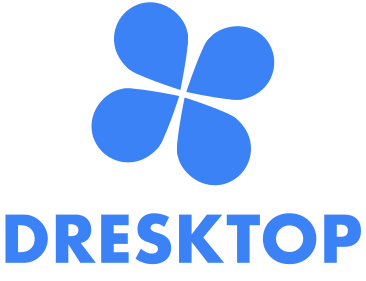

  

  

    <a href="https://dresktop.com">Visit website</a>
    ·
    <a href="https://github.com/dresktop/dresktop/issues/new?labels=bug&template=bug-report---.md">Report Bug</a>
  

<!-- TABLE OF CONTENTS -->

  
Table of Contents

  <ol>
    <li>
      <a href="#getting-started">Getting Started</a>
      <ul>
        <li><a href="#prerequisites">Prerequisites</a></li>
        <li><a href="#installation">Installation</a></li>
      </ul>
    </li>
    <li><a href="#features">Features</a></li>
    <li><a href="#roadmap">Roadmap</a></li>
    <li><a href="#contributing">Contributing</a></li>
    <li><a href="#license">License</a></li>
  </ol>

<!-- ABOUT THE PROJECT -->
## Dresktop

[![Product Name Screen Shot][product-screenshot]](https://dresktop.com)

Dresktop is a cross-platform desktop application designed to streamline the management of Drupal projects. This tool simplifies the process of creating and managing local Drupal installations using Docker. Additionally, it provides a unified interface for administering both local and cloud-based Drupal projects.

(<a href="#readme-top">back to top</a>)

<!-- GETTING STARTED -->
## Getting Started

### Prerequisites
- Application: Docker and git.
- Cloud environments: SSH access, Git, Rsync.

### Installation

Download the latest version of Dresktop from the [GitHub releases](https://github.com/dresktop/dresktop/releases) page. 

(<a href="#readme-top">back to top</a>)

<!-- Features -->
## Features

- Multi-Platform
- Open Source
- Manage applications same place
- Desktop and cloud environments
- Tools
    - Deploy
    - Updates
    - Run PHP code
    - Run bash scripts
    - Run cron
    - Cache rebuild
- Services
    - Extend functionality with Adminer and Mailpit
    - Switch code branch
    - Database import, export and synchronization from other environments
    - Files synchronization from other environments

(<a href="#readme-top">back to top</a>)

<!-- ROADMAP -->
## Roadmap

- [ ] Select database
- [ ] Select Drupal version
- [ ] Display Drupal version
- [ ] Deploy
    - [ ] Deploy vendor folder usync Rsync
    - [ ] Custom deploy tags
- [ ] Multilanguage
- [ ] Apply patches

(<a href="#readme-top">back to top</a>)

<!-- LIMITATIONS -->
## Limitations
- Dresktop currently supports only macOS and Linux operating systems and the ARM64 architecture.
- **Port Requirements:** Ports 80 and 443 are required for ACME HTTP and TLS-ALPN challenges to obtain publicly trusted TLS certificates, so using non-standard ports is not possible at the moment.

(<a href="#readme-top">back to top</a>)

<!-- CONTRIBUTING -->
## Contributing

Welcome to Dresktop. If you want to contribute, please fork the repo and create a pull request. Don't forget to give the project a star! 

1. Fork the Project
2. Create your Feature Branch (`git checkout -b feature/AmazingFeature`)
3. Commit your Changes (`git commit -m 'Add some AmazingFeature'`)
4. Push to the Branch (`git push origin feature/AmazingFeature`)
5. Open a Pull Request

(<a href="#readme-top">back to top</a>)

<!-- LICENSE -->
## License

Distributed under the Apache License 2.0. See [License][license-url] for more information.

(<a href="#readme-top">back to top</a>)

[license-url]:https://github.com/dresktop/dresktop/blob/master/LICENSE.txt
[product-screenshot]: src/assets/screenshot.png